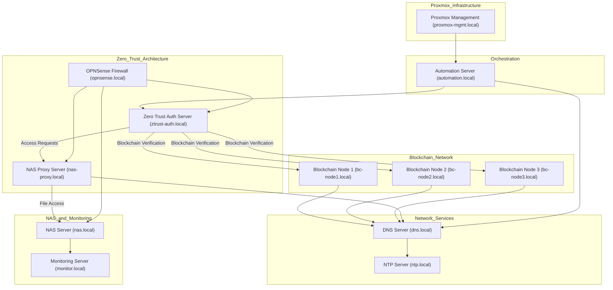

# Network Diagram for Blockchain ZTA Project

# Network Diagram Legend for Blockchain ZTA Project

| **Server Name**           | **Category**                | **Network**         | **IP Address** |
|---------------------------|-----------------------------|---------------------|----------------|
| `proxmox-mgmt.local`      |Virtualization Host          | Management Network  | [To be filled] |
| `automation.local`        | Orchestration               | Management Network  | [To be filled] |
| `ztrust-auth.local`       | ZTA - Access Control        | ZTA Network         | [To be filled] |
| `nas-proxy.local`         | ZTA - Access Proxy          | ZTA Network         | [To be filled] |
| `opnsense.local`          | Network Security            | All Networks        | [To be filled] |
| `bc-node1.local`          | Blockchain Network          | Blockchain Network  | [To be filled] |
| `bc-node2.local`          | Blockchain Network          | Blockchain Network  | [To be filled] |
| `bc-node3.local`          | Blockchain Network          | Blockchain Network  | [To be filled] |
| `nas.local`               | File Storage                | Storage Network     | [To be filled] |
| `monitor.local`           | Monitoring and Logging      | Management Network  | [To be filled] |
| `dns.local`               | Network Services            | Management Network  | [To be filled] |
| `ntp.local`               | Network Services            | Management Network  | [To be filled] |

---

## Network Assignments
- **Management Network**: Used for Proxmox management, orchestration, and general administrative functions.
- **ZTA Network**: Dedicated network for Zero Trust Architecture services, isolating access control and authentication.
- **Blockchain Network**: Network dedicated to blockchain nodes to handle access verification, minimizing external traffic.
- **Storage Network**: Network solely for the NAS, access

